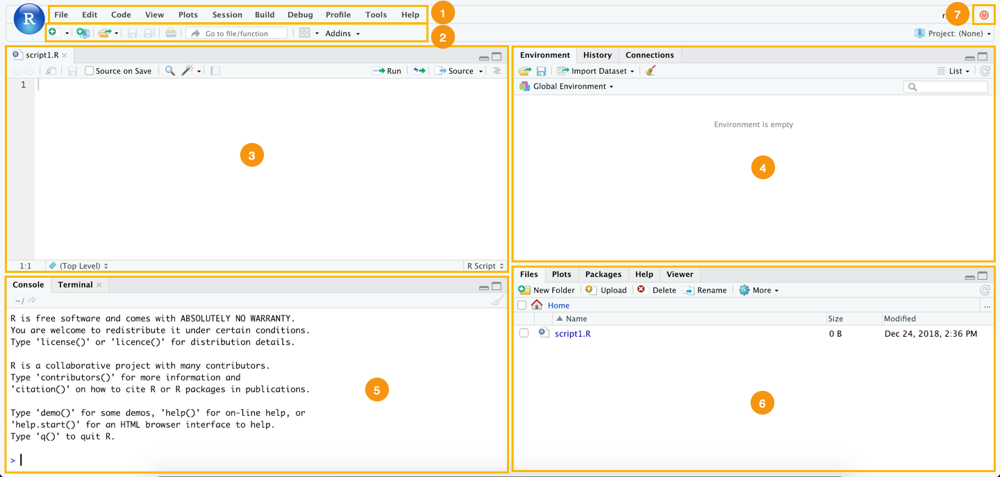
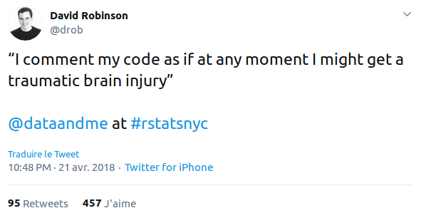
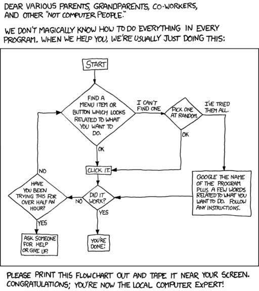

background-image: url("https://media.giphy.com/media/xT1R9ScK8XbiRQv70Y/giphy.gif")
class: center, top, inverse

# 1. Déroulement du cours

---

## Objectifs

**Ce cours a pour vocation de vous initier à l'usage journalistique d'outils de programmation statistique (en l'occurence R).**

Il couvrira sous un angle programmatique tous les aspects de la démarche journalistique :
1. la recherche de source ;
2. le traitement des informations ;
3. leur mise en forme.

Nous utiliserons donc de l'informatique, de la statistique, de l'épistémologie, de la bibliographie ...

--

### Mais pour faire du **journalisme**.

La donnée est un moyen et non une fin.

---

## Trousse à outil

1. [R (base)](https://www.r-project.org/) : notre langage de référence ;
2. [Rstudio](https://rstudio.com/) : notre interface de base ;
3. [Sublime Text 3](https://www.sublimetext.com/) : notre éditeur de texte de référence et outil à tout faire.

--

Ces outils nécessitent l'usage courant de plusieurs langages ou syntaxes :
* **R**, langage de programmation statistique orienté objet ;
* **Markdown**, syntaxe de mise en forme de texte ;
* les **regex** (ou *expression régulière*), langage formel de description des chaînes de charactère ;
* **Xpath**, langage de requêtes utilisé pour traiter les formats HTML et XML.

Chacun de ces outils sera présenté, documenté et utilisé de manière concrète pendant le cours. La théorie sera réduite au strict minimum nécessaire, nous sommes dans un cours pratique.

---

## Fonctionnement de ce cours


### Documentation
L'intégralité des contenus utilisés durant le cours est disponible sur la page Github de ce cours : https://github.com/SylvainLapoix/ipj_ddj_20192020.

Les slides de ce cours sont disponibles en format HTML à la page suivante : https://sylvainlapoix.github.io/ipj_ddj_20192020/cours01

### Evaluation
A la fin de chaque cours, je vous donnerai un petit exercice d'application à réaliser pour le cours suivant. J'en préciserai le sujet et le format. Un plus gros projet vous sera demandé pour l'évaluation finale.

### Communication
Je vous invite à me contacter par WhatsApp pour les questions ponctuelles et à n'utiliser le mail que pour les questions nécessitant des mises en copie ou de l'archivage (par exemple, les absences).

---

## Grands principes

**Je vous encourage à vous tourner vers des solutions programmatiques et open source** pour le maximum de vos usages : la dépendance aux outils propriétaires (qu'ils soient payant ou gratuit) peut constituer une faiblesse voire un danger pour les journalistes (cf. Google Fusion Tables et autres plantages).

Ce cours est un premier essai, il se construira avec vous : vos retours, vos suggestions, vos trouvailles, vos critiques ...

--

... donc, **posez des questions, le maximum, dès que vous en ressentez le besoin : vous ferez avancer tout le monde, moi y compris**.

Des pertes de temps considérables sont évitées chaque jour par l'application de bonnes habitudes :
* **documentez** vos idées, vos réussites, vos erreurs, vos blocages ...
* **interrogez** vos collègues, vos outils, la communauté ...
* **partagez** vos trouvailles, vos bonnes pratiques et votre code.

---

background-image: url("https://media.giphy.com/media/l4JyOCNEfXvVYEqB2/giphy.gif")
class: center, top, inverse

# 2. R, la base

---

.center[
## Pourquoi programmer ?
]

--

.center[
## Mais oui, après tout, pourquoi ?
]


--


.center[
# POURQUOI ?????????
]

--

.footnote[Calmez-vous, vous me faîtes peur.]

---

## Programmer en tant que journaliste 1/2

Maîtriser un ou plusieurs langage de programmation, même à un niveau peu avancé, présente de nombreux avantages pour un·e journaliste :

**1. accès aux sources**
Le traitement programmatique donne accès à des sources autrement inaccessibles : APIs, registres massifs, bases de données, scraping ...

**2. capacité de traitement**
Les outils en interface graphique (ou *GUI*) ont des limites fortes en volume et complexité de traitement que la programmation permet de lever.

**3. production de formats originaux**
La programmation ouvre une large palette de formats inacessibles autrement : graphs, interactivité, expérience personnalisée, temps réel, etc.

**4. compréhension technique**
La manipulation même de l'outil informatique constitue une porte d'entrée dans la réalité technique d'une des composantes centrales de notre société (et donc de sujets qui la traversent).

**5. reproductibilité**
Là où les outils en *GUI* nécessitent de reprendre à zéro toute manipulation de données, la programmation permet de reproduire, affiner et perfectionner ses travaux.


---

## Programmer en tant que journaliste 2/2

**6. communication avec d'autres métiers**
Les langages et logiques de programmation constituent la base de la pratique de nombreux métiers, que ce soit dans l'informatique, la recherche ou l'industrie. Partager cette syntaxe facilite la communication et l'échange d'information ou de bonnes pratiques : une bonne occasion de s'inspirer de ces métiers pour mieux faire le vôtre.

**7. rigueur et logique**
Les logiques sous-jacentes à l'informtique reposent sur un rapport à l'information très différent de celui habituellement mobilisé dans le journalisme. Au déclaratif, contextuel et émotionnel, l'informatique substitue des systèmes de classification catégorielle, une nécessite de structuration de la pensée qui complète ce mode.

--

En un mot, l'informatique peut faire de vous de meilleur·e·s journalistes.

---

## Pourquoi R ?

R est un langage de programmation puissant, versatile et en perpétuelle amélioration conçu par et pour des usager·ère·s quotidien·ne·s de la donnée.

Il bénéficie de plusieurs atouts clefs qui le rendent extrêmement pratique :
* **une documentation détaillée et facile à trouver** ;
* un large spectre **d'extension et de packages adaptés à tous les besoins** (cette présentation est, par exemple, intégralement réalisée en R) ;
* **une forte interopérabilité avec nombres d'autres technologies et outils** (APIs, autres langages comme C, SQL, Javascript ou Python, etc.) ;
* **une communauté étendue et accueillante** ;
* et, cerise sur le gâteau, c'est **open source**.

---

background-image: url(https://media.giphy.com/media/Ae7SI3LoPYj8Q/giphy.gif)
class: center, top
## Avec R, vous ne serez jamais seul·e !


---

background-image: url("https://media.giphy.com/media/xA28qUvHKigcE/giphy.gif")
class: center, bottom, inverse

# L'heure de l'installation est venue !

---

## Rstudio : votre interface



.footnote[Je vous recommande par ailleurs [les nombreuses "cheatsheet" mises à disposition par l'équipe de Rstudio](https://www.rstudio.com/resources/cheatsheets/).]

---

## La ligne de commande

La **console** (ou "invite de commande") de R vous permet de réaliser des opérations sans utiliser l'interface graphique (GUI) : il s'agit d'une "interface en ligne de commande" (ou CLI).

Elle permet de réaliser des opérations simples, lancer des scripts et tester des bouts de code.


---

## Opérations simples

R vous permet de réaliser toutes les opérations arithmétiques de base : il vous suffit de les saisir au clavier dans la console :

```{r}
2+5

3*5+231

# R gère également les priorités
2*5+10
2*(5+10)

5%%2 # et les modulos

```

---

## Variables

Les variables sont des **objets** permettant de stocker une valeur, c'est-à-dire une donnée ou une structure de données (nous verrons ça dans un instant).


```{r}
effectif <- 8
effectif

effectif <- 9 # On peut "réassigner" la valeur d'une variable à volonté
effectif - 1 # et en manipuler la valeur

```

La valeur est **assignée** à la variable par `<-` ou `=`.
La valeur est une chaîne de caractères de longueur libre. Il existe cependant quelques restrictions : elle ne peut débuter par un chiffre (ex. 9efj) et certains mots sont dit "interdits" car ils correspondent à des variables définies par ailleurs.


---

## Structures de données 1/2

Les structures de données sont de objets qui permettent de stocker de manière organisées plusieurs valeurs. **La strucutre de référence de R est le vecteur** : une suite de valeur d'une seule dimension :
```{r}
prenoms <- c("François","Etienne","Chloé","Thomas","Aimée")
prenoms
prenoms[2] # on appelle une valeur par son index*

```

**Toutes les structures de données de R peuvent être construites avec ou décompensées en vecteurs**.

.footnote[\* Dans R, l'index débute à 1: le premier élément d'un vecteur est nomduvecteur[1], le 2è nomduvecteur[2], etc. Contrairement à certains langages ou il débute à 0.]

---

## Structures de données 2/2

* Matrices
* Dataframes

---

## Fonctions

* fonctions exploratoires de base
* paramètres
* création de fonctions

---

## Type de données (rappel)

* numériques (integer et doubles / float)
* chaînes de caractères
* booléens
* autres (dates et cie)
* \#N/A et null

---

## Packages

---

## Tidyverse : la référence de la data science


---

## Le script : votre chaîne de commandes

---

background-image: url("https://media.giphy.com/media/ZHlGzvZb130nm/giphy.gif")
class: center, top, inverse

# 3. Trouver et charger des bases de données

---

## Les formats de fichier

* les gentils formats
* les méchants formats
* les formats dégueulasses

---

## Charger un CSV dans R (avec Tidyverse)

* read_csv()
* les params

---

## L'open data à la rescousse

---

## Recherche avancée sur Google

---


background-image: url("https://media.giphy.com/media/xT1XGzAnABSXy8DPCU/giphy.gif")
class: center, top, inverse

## La prochaine fois on parle de scraping, c'est promis !

---


background-image: url("https://media.giphy.com/media/VXCPgZwEP7f1e/giphy.gif")
class: center, top, inverse

# 4. Conseils pratiques

---

## Commentez tout le temps

Les commentaires sont des bouts de code "non exécuté" que vous pouvez glisser dans votre code en précédent d'un `#`. Ils vous permettent, entre autres :
* de marquer les étapes dans votre script ;
* d'expliciter l'usage d'une fonction ;
* de sourcer une méthode ;
* de pointer des problèmes ...

Ce sont de précieux marques-pages ou penses-bêtes qui vous aideront ainsi que celles et ceux avec qui vous partagerez votre code. Suivez donc les conseils des meilleur·e·s usager·ère·s de R : [commentez un maximum](https://twitter.com/drob/status/987795355659112453) !



---

## Sachez où trouver des réponses

.pull-left[


]

.pull-right[
La documentation est surabondante sur R : **si vous rencontrez une erreur en tant que débutant·e, il y a de fortes chances que quelqu'un·e l'ai déjà rencontrée avant vous !**

Soyez-donc méthodique :
* **lisez vos erreurs** ;
* cherchez dans la documentation en tapant ? ou ?? avant le nom d'une lib ou d'une fonction dans la console ;
* copiez-collez le message dans Google ;
* regardez sur [StackOverflow](https://stackoverflow.com/) ;
* **documentez vos erreurs** ;
* une fois que vous avez tout essayé, vous pouvez m'écrire.
]

---
.center[

]


---

background-image: url("https://media.giphy.com/media/3o7ablgOdO5RLkscY8/giphy.gif")
class: center, top, inverse

# 5. L'exercice de la semaine

---

## Première exploration de données


---
class: inverse, center, middle

# Merci !


Contact : [sylvainlapoix@gmail.com](mailto:sylvainlapoix@gmail.com) ou via WhatsApp.


