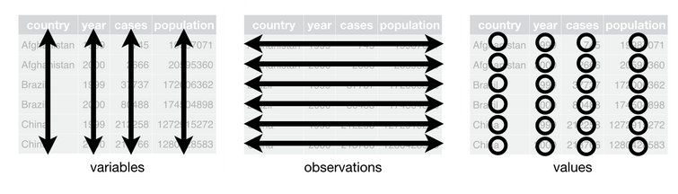

background-image: url("http://giphygifs.s3.amazonaws.com/media/TT2zE430gSlHO/giphy.gif")
class: center, top, inverse

# 1. Charger / sauvegarder

---

## Gérer ses scripts

Quelques conseils de base :
1. créer un projet pour chaque sujet traité (ce cours, par exemple) et d'y organiser un "framework" ;
2. créer un script pour chaque exploration de données (d'une ou plusieurs BDDs) ;
3. stocker vos BDDs dans un dossier *"data"* ;
4. sauvegarder souvent (idéalement, à chaque modification) ;
5. toujours garder les BDDs originales ;
6. créer des versions intermédiaires (notamment pour subseter et alléger le chargement) en sauvegardant vos dataframes en .csv (ou en .Rdata, éventuellement) ;
7. nommer tout de manière claire, explicite et concise.

---

## Généralités sur le script

Le script vous sert à enchaîner vos commandes et consigner vos manipulations. C'est un mélange de chaîne de montage et de carnet de notes.

`## PARTIE -----` vous permet de créer une section et un point de navigation rapide (en bas à gauche de votre interface).

Tout d'abord, **chargez les librairies indispensables** (je vous conseille d'ailleurs de systématiquement mettre en début de script toutes les libs utiles). Notamment le `tidyverse` qui contient `readr` donc les fonctions que nous utilisons.

```{r, message = FALSE}
library(tidyverse)
```


Pour ne pas vous perdre, je vous conseille de paramétrer votre répertoire de travail (*working directory*) manuellement :
* `getwd()` vous donne le PATH absolu de là où vous travaillez ;
* `setwd("PATH")` vous permet de le modifier au profit du PATH indiqué.

Cette manip sera utile pour utiliser les *chemins relatifs* par la suite.

Puis **chargez les données dont vous aurez besoin en ligne de commande**.

---

### Charger les données

Il existe des foncitons adaptées à chaque type de fichier. Je vous conseille d'utiliser le *chemin relatif* (ça vous obligera à ranger vos affaires au passage) :
* `a <- read_csv(PATH)` : pour les CSV séparés par des virgules ;
* `b <- read_csv2(PATH)` : pour les CSV séparés par des points virgules (ou SCSV) ;
* `c <- read_delim(PATH, sep="SEP")` : pour les fichiers séparés par d'autres signes.

```{r, message = FALSE}
prenoms <- read_csv2("../data/liste-des-prenoms-par-annee.csv")
```


Pour les fichiers Excel, vous pouvez utiliser la librairie **[xlsx](https://cran.r-project.org/web/packages/xlsx/index.html)** suivant la nomenclature suivante (avec les params adéquats) :
* `d <- read.xlsx(PATH, sheetIndex = 1, startRow = 4,as.data.frame=TRUE)`

**Rappel** :
Pensez à charger les libs ou packages nécessaires :
* les fonctions `read_*` proviennent de la librairie `readr`, dont le tidyverse ;
* la fonction `read.xlsx` provient de `xlsx`.

---

### Sauvegarder

Il est utile de sauvegarder à plusieurs moments :
* pour économiser les manipulations nécessaires à la constitution d'un subset ;
* pour garder une version de votre BDD en l'état et reprendre vos manipulations plus tard ;
* pour stocker et partager vos résultats.

Pour sauvegarder, il vous suffit d'utiliser la fonction correspondant au format et d'y passer la variable où est stockée la structure de données et le path où vous voulez sauvegarder avec le nom du fichier cible :
* `write_csv(a, "PATH/a.csv")` : pour sauvegarder un CSV ;
* `save(b, "PATH/b.Rdata")` : pour sauvegarder un fichier Rdata.

---

background-image: url("https://media.giphy.com/media/ZdIDsxm4sNymApoC25/giphy.gif")
class: center, top, inverse

# 2. Premiers contacts avec une BDD

---

## Infos de base


Le panneau supérieur gauche vous offre un premier aperçu : nom de la variable où est stockée la structure, nbre d'obs, nbre de variables.

#### Nom des variables

```{r}
names(prenoms)
```

Si vous n'êtes pas satisfait·e, c'est le moment de les réassigner (si possible : en bas de casse, sans espace et sans caractères spéciaux).

---

#### Aperçu

La fonction "head" vous offre un premier aperçu avec les "n"" 1ères observations (6 par défaut) : structure, forme des valeurs, types des variables, etc.

```{r}
head(prenoms, n = 3) # vous pouvez aussi utiliser son inverse : tail()
```

#### Synthèse

```{r}
glimpse(prenoms) # alternative à summary() dans le tidyverse
```

---

#### Diversité et distribution des valeurs

```{r}
unique(prenoms$ANNEE) # pour voir toutes les valeurs uniques
table(prenoms$ANNEE) # pour obtenir le compte de l'occurrence de chacune
```


---

background-image: url("https://media.giphy.com/media/jTAfBmBgdMzwA/giphy.gif")
class: center, top, inverse

# 3. Manipulation de la BDD

---

## Structure d'une base de donnée




.pull-left[Cette structure de base est le modèle proposé par *Hadley Wickham*, créateur du `tidyverse`, le modèle **tidy data**.

Ce schéma correspond aux modalités de manipulation d'une base de données. Aussi, c'est le vobaculaire que nous utiliserons à partir de maintenant (notamment pour le paramétrage des fonctions).]

.pull-right[
.right[

]
]

---

### Sélectionner par index

```{r}
mtcars[10,] # pour choisir une observation par index
mtcars[,3] # pour choisir une variable par index

mtcars[2:4,] # pour choisir des obs consécutives par index
mtcars[c(2,6),] # pour choisir des obs non consécutives par index
```


---

### Aparté : les tests 1/2

Un test est une opération qui consiste à vérifier une condition sur un objet :

```{r}
5 == 3 # chaque test renvoie une ou plusieurs valeurs booléennes
5 < 3
5 > 3
5 >= 3
5 != 3
```


---

### Aparté : les tests 2/2

En R, un test appliqué à une structure de données à une dimension (vecteur, liste, etc.) renvoie un vecteur de valeurs booléennes : chaque valeur correspond au résultat du test sur la valeur de même index dans l'objet testé.

```{r}
prenoms[1:20,]$SEXE == "M"
```

Le vecteur ainsi produit permet de sélectionner des observations de manière conditionnelle.

En clair :
**Les tests sont la base de la sélection conditionnelle.**

---

## Le "data wrangling" avec le tidyverse

Une grosse partie du travail sur les données consiste à les manipuler de façon à leur donner la forme nécessaire à leur manipulation. Ensemble de tâches qu'on désigne sous le nom de **"data wrangling\*"**.

[Selon une enquête du New York Times](https://www.nytimes.com/2014/08/18/technology/for-big-data-scientists-hurdle-to-insights-is-janitor-work.html), cette tâche prendrait 50 à 80% du temps des data scientists interrogés.

Le tidyverse répond en partie à ce besoin : dispose d'outils efficaces et puissants pour rendre les données manipulables.

Deux librairies sont spécifiquement conçus à cette fin :
* dplyr : pour manipuler les données ;
* tidyr : pour reformater (notamment en tidy data).

.footnote[\* Je cherche encore [une traduction](https://twitter.com/SylvainLapoix/status/1193934916003729408).]


---

### Dplyr, pour bien explorer ses données

#### Filter : pour la sélection conditionnelle

Filter permet de sélectionner des observations sur la base d'un test sur une variable :

```{r}
filter(prenoms,NOMBRE > 150) # permet de savoir quels prénoms ont été attribués plus de 150 fois la même année

filter(prenoms,NOMBRE > 130 & SEXE == "M") # filter permet de filter sur plusieurs variables simultanément
```

---

#### Filter 2 : sélection fine avec stringr

Des fonctions dîtes "helpers" permettent de réaliser des tests plus fins.

Le package `stringr` offre plusieurs fonction de test. `str_detect()` permet par exemple de vérifier de manière partielle une chaîne de caractère et, ainsi, de récupérer les valeurs contenant une certaine expression :

```{r}
filter(prenoms, str_detect(PRENOM,"ë"))
```

---

### Aparté : les opérateurs

Plusieurs conditions peuvent être cumulées dans un filtre suivant diverses modalités.

Pour cela, R propose plusieurs opérateurs :
* `&` (espérluette, se lit "*and*") : pour combiner deux conditions de façon stricte (l'une et l'autre doivent être vraies) ;
* `|` (pipe, se lit "*or*") : pour deux conditions mutuellement exclusive, l'une ou l'autre doit être vraie mais pas les deux ;
* `!` (se lit "*not*") : pour nier une condition (pratique pour formuler "tout sauf ...").


```{r}
filter(prenoms,NOMBRE > 130 | SEXE == "M") # à comparer avec le 2è filtre de la 1ère slide sur la fonction filter()
```


---

### Aparté : les opérateurs 2

**Attention** : les opérateurs `&` et `|` doivent être placé entre deux tests, pas à l'intérieur d'un des tests. L'opérateur `!` doit être placé avant le test entre parenthèse.

```{r}
filter(prenoms,!(str_detect(PRENOM,"e")))
```


---

### Aparté : l'opérateur %in%

En complément des opérateurs logiques usuels, le `tidyverse` ajoute un opérateur très pratique : le `%in%` qui permet d'établir une égalité non pas avec une valeur mais avec n'importe laquelle des valeurs contenues dans un vecteur.

```{r}
filter(prenoms, PRENOM %in% c("Yannick","Yanick","Yanik"))
```


---

#### Select : pour la sélection de variable

La fonction `select()` permet de sélectionner des variables de manière littérale ou conditionnelle. Sa nomenclature est similaire à `filter()` :

```{r}
select(prenoms,PRENOM)[1:5,] # permet de ne retenir que la variagble PRENOM

p <- select(prenoms,c(ANNEE,SEXE,PRENOM,NOMBRE))
p[1:3,]
```

---

#### Select 2 : les helpers

`dplyr` propose également des fonctions helpers pour affiner la sélection. Comme pour `stringr` elles fonctionnent suivant des tests de détections de chaîne de caractère :

```{r}
select(prenoms, contains("ANNEE"))[1:3,]

```

---

#### Mutate pour la création de variables

`Mutate` permet de créer une nouvelle variable. Elle peut être soit conditionnelle, soit arbitraire (même valeur partout).

```{r}
mutate(p, majeur = ANNEE < 2001)[1:3,] # ce test permet de savoir si les personnes à qui ont été attribués les prénoms sont majeures ou non
```

.footnote[Vous noterez ici qu'il s'agit d'une *"traduction"* d'une notion sociale en test informatique.]

---

#### Arrange pour trier par ordre

```{r}
arrange(p, NOMBRE)[1:3,]
arrange(p, desc(NOMBRE))[1:3,] # le helper desc() permet de trier par ordre décroissant
```

---

#### Arrange 2

```{r}

arrange(p, PRENOM)[1:3,] # arrange fonction aussi avec des strings
arrange(p, PRENOM, ANNEE)[1:3,] # et plusieurs critères

```

---

#### Distinct pour les valeurs uniques

```{r}
distinct(p, ANNEE)
```


#### Top_n pour un classement rapide

```{r}
top_n(p,5,NOMBRE)
top_n(p,-5,NOMBRE) # qui marche aussi en "bottom_n"
```

---

#### Pipe pour chaîner tout ça

L'opérateur `%>%` est appelé **le pipe**. Il s'agit d'un outil permettant de "passer" la sortie d'une fonction en entrée d'une autre. Elle est également dispo avec le raccourci : `Ctrl + Shift + m`.

Cet opérateur permet de créer des chaînes de commandes et, ainsi, d'éviter les matriochkas ou les variables intermédiaires.

```{r}
prenoms %>% filter(SEXE == "F", ANNEE < 2001) %>% 
  select(PRENOM,ANNEE,NOMBRE) %>% 
  top_n(10, NOMBRE)
```


---

### Group_by et summarise : pour synthétiser

Les fonctions `group_by` et `summarise` fonctionne en tandem :
* `group_by` sert à constituer des groupes suivant les valeurs des variables au sein d'une structure de données ;
* `summarise` permet de créer des variables de synthèse sur la base des observations ainsi "groupées".

```{r}
# je me concentre ici sur les prénoms masculins
p %>% filter(SEXE == "M") %>% 
  group_by(ANNEE) %>%         # je groupe par année
  summarise(n = n()) %>%      # je compte le nombre d'obs
  arrange(desc(n))            # je tri par n
```

---

#### Group_by et summarise 2

Il est possible de grouper par plusieurs variables :

```{r}
# nous allons nous intéresser aux prénoms qui commencent par un K
p %>% filter(str_detect(PRENOM, "^K")) %>% 
  group_by(ANNEE,SEXE) %>% # nous groupons ensuite par année et sexe
  # et faisons la somme des enfants nommés ainsi
  summarise(effectif = sum(NOMBRE)) %>%
  arrange(desc(ANNEE))
```


---

background-image: url("https://media.giphy.com/media/3jmfMCLZkU5SyNXDf6/giphy.gif")
class: center, top, inverse

# Et dans deux semaines ...

---

## Programme du cours 3

* Tidyr, pour bien ranger ses données ;
* ggplot, pour visualiser ses résultats ;
* web-scraping / PDF-scraping en R ;
* l'EDA, analyse exploratoire de données.

---
class: inverse, center, middle

# Merci !


Contact : [sylvainlapoix@gmail.com](mailto:sylvainlapoix@gmail.com) ou via WhatsApp.


